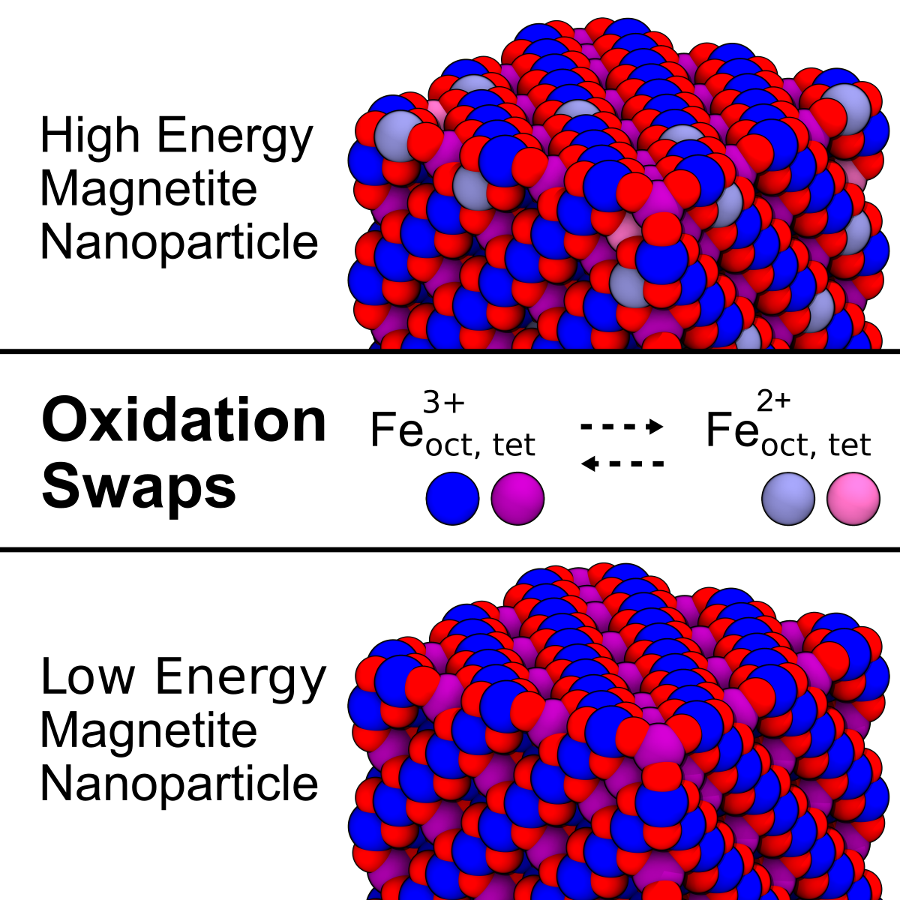

# Bulk Magnetite Supporting Scripts

[](https://pubs.acs.org/doi/full/10.1021/acs.jpclett.3c01290)  
This repository contains scripts and data related to the bulk section of the following publication:  
**Oxidation-State Dynamics and Emerging Patterns in Magnetite** 



## Overview  
This repository is part of the computational workflow used to study the structural and thermodynamic properties of bulk magnetite. The provided scripts focus on [specific focus area, e.g., bulk section modeling], serving as a supplementary resource for the publication.  

## Repository Structure  
```
bulk_magnetite/
│
├── 211119_bulk_magnetite/               # Python/other scripts for simulations
| ├── 1_generate_bulk/
| ├── 2_oxidation_state_min/
| ├── 3_NVT_MC_comparison/
| | ├── 1_NVT/
| | ├── 2_NVT_MC/
| | ├── 3_analyze/
| ├── 4_Npt_MC_comparison/
| ├── 5_oxidation_state_min_different_scheme/
├── 220602_bulk_magnetite_production/                  # Input files or sample datasets
| ├── 220730_charge_ordering_and_swap_prob/
| ├── 220908_RDF/
| ├── 220919_varying_size/
| ├── 221021_trimeron_analysis/
| ├── 230406_heating_up_hysterisis/
├── 230207_example_input_script/               # Example outputs or visualizations
├── 230308_bulk_magnetite_transition/
| ├── 1_Fd3m/
| ├── 2_Cc/
└── README.md              # Repository documentation
```

## Related Publications  
If you use this repository, please cite the original paper:  
```bibtex
@article{Grsoy2023,
  title = {Oxidation-State Dynamics and Emerging Patterns in Magnetite},
  volume = {14},
  ISSN = {1948-7185},
  url = {http://dx.doi.org/10.1021/acs.jpclett.3c01290},
  DOI = {10.1021/acs.jpclett.3c01290},
  number = {30},
  journal = {The Journal of Physical Chemistry Letters},
  publisher = {American Chemical Society (ACS)},
  author = {G\"{u}rsoy,  Emre and Vonbun-Feldbauer,  Gregor B. and Meißner,  Robert H.},
  year = {2023},
  month = jul,
  pages = {6800–6807}
}
```
